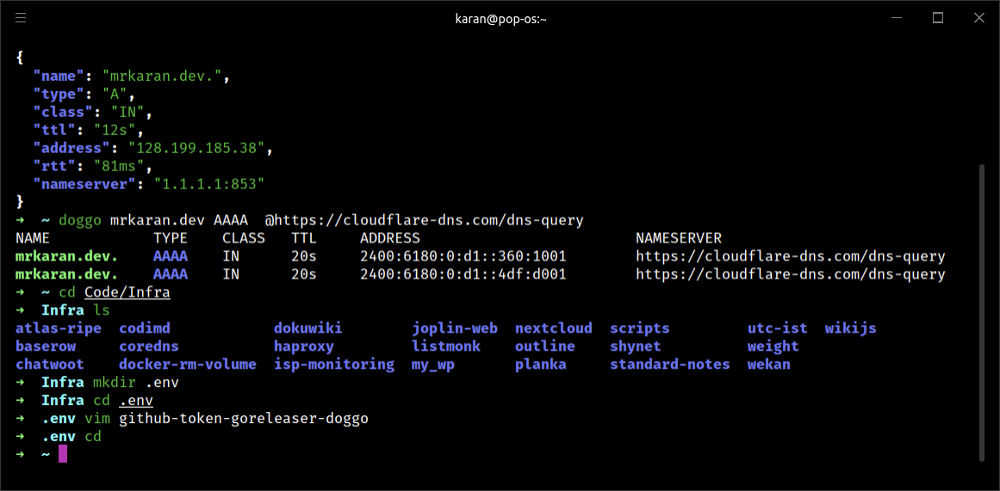
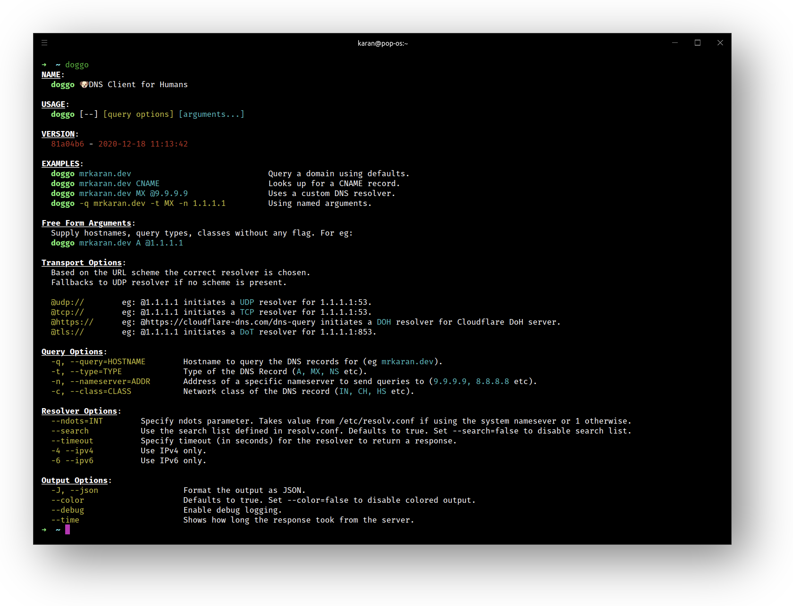

<!-- PROJECT LOGO -->
<br />
<p align="center">
  <h2 align="center">doggo</h2>
  <p align="center">
    🐶 <i>Command-line DNS client for humans</i>
  </p>
  
</p>

---

`doggo` is a modern command-line DNS client (like _dig_) written in Golang. It outputs information in a neat concise manner and supports protocols like DoH, DoT as well.

It's totally inspired from [dog](https://github.com/ogham/dog/) which is written in Rust. I wanted to add some features to it but since I don't know Rust, I found it as a nice oppurtunity
to experiment with writing a DNS Client from scratch in `Go` myself. Hence the name `dog` +`go` => `doggo`.

## Features

- Human readable output - Supports colors and tabular format.
- Supports JSON format - useful for writing scripts.
- Has support for multiple transport protocols:
  - DNS over **HTTPS** (DoH)
  - DNS over **TLS** (DoT)
  - DNS over **TCP**
  - DNS over **UDP**
- Supports **ndots** and **search** configurations from `resolv.conf` or command-line arguments.
- Supports multiple resolvers in one go.
- Supports IPv4 **and** IPv6 _both_.

## Installation

### Binary (Recommended)

### Docker

### Snap

## Usage Examples

**Do a simple DNS Lookup for `mrkaran.dev`**

```bash
$ doggo mrkaran.dev                                                                         
NAME            TYPE    CLASS   TTL     ADDRESS         NAMESERVER   
mrkaran.dev.    A       IN      20s     13.250.205.9    127.0.0.1:53
mrkaran.dev.    A       IN      20s     206.189.89.118  127.0.0.1:53
```

**Query MX records for `github.com` using `9.9.9.9` resolver**

```
doggo MX github.com @9.9.9.9
NAME            TYPE    CLASS   TTL     ADDRESS                         NAMESERVER 
github.com.     MX      IN      3600s   10 alt3.aspmx.l.google.com.     9.9.9.9:53
github.com.     MX      IN      3600s   5 alt1.aspmx.l.google.com.      9.9.9.9:53
github.com.     MX      IN      3600s   10 alt4.aspmx.l.google.com.     9.9.9.9:53
github.com.     MX      IN      3600s   5 alt2.aspmx.l.google.com.      9.9.9.9:53
github.com.     MX      IN      3600s   1 aspmx.l.google.com.           9.9.9.9:53
```

or using _named parameters_:

```bash
$ doggo -t MX -n 9.9.9.9 github.com
NAME            TYPE    CLASS   TTL     ADDRESS                         NAMESERVER 
github.com.     MX      IN      3600s   10 alt3.aspmx.l.google.com.     9.9.9.9:53
github.com.     MX      IN      3600s   5 alt1.aspmx.l.google.com.      9.9.9.9:53
github.com.     MX      IN      3600s   10 alt4.aspmx.l.google.com.     9.9.9.9:53
github.com.     MX      IN      3600s   5 alt2.aspmx.l.google.com.      9.9.9.9:53
github.com.     MX      IN      3600s   1 aspmx.l.google.com.           9.9.9.9:53
```

**Query DNS records for archive.org using Cloudflare DoH resolver**

```bash
$ doggo archive.org @https://cloudflare-dns.com/dns-query 
NAME            TYPE    CLASS   TTL     ADDRESS         NAMESERVER                           
archive.org.    A       IN      41s     207.241.224.2   https://cloudflare-dns.com/dns-query
```

**Query DNS records for internetfreedom.in with JSON output**

```bash
$ doggo internetfreedom.in --json | jq
{
  "responses": {
    "answers": [
      {
        "name": "internetfreedom.in.",
        "type": "A",
        "class": "IN",
        "ttl": "22s",
        "address": "104.27.158.96",
        "rtt": "37ms",
        "nameserver": "127.0.0.1:53"
      },
      {
        "name": "internetfreedom.in.",
        "type": "A",
        "class": "IN",
        "ttl": "22s",
        "address": "104.27.159.96",
        "rtt": "37ms",
        "nameserver": "127.0.0.1:53"
      },
      {
        "name": "internetfreedom.in.",
        "type": "A",
        "class": "IN",
        "ttl": "22s",
        "address": "172.67.202.77",
        "rtt": "37ms",
        "nameserver": "127.0.0.1:53"
      }
    ],
    "queries": [
      {
        "name": "internetfreedom.in.",
        "type": "A",
        "class": "IN"
      }
    ]
  }
}
```

**Query DNS records for duckduckgo.com and show RTT (Round Trip Time)**

```bash
$ doggo duckduckgo.com --time                
NAME            TYPE    CLASS   TTL     ADDRESS         NAMESERVER      TIME TAKEN 
duckduckgo.com. A       IN      30s     40.81.94.43     127.0.0.1:53    45ms      
```

## Command-line Arguments



### Transport Options

URL scheme of the server is used to identify which resolver to use for lookups. If no scheme is specified, defaults to `udp`.

```
  @udp://        eg: @1.1.1.1 initiates a UDP resolver for 1.1.1.1:53.
  @tcp://        eg: @1.1.1.1 initiates a TCP resolver for 1.1.1.1:53.
  @https://      eg: @https://cloudflare-dns.com/dns-query initiates a DOH resolver for Cloudflare DoH server.
  @tls://        eg: @1.1.1.1 initiates a DoT resolver for 1.1.1.1:853.
```

### Query Options

```
  -q, --query=HOSTNAME        Hostname to query the DNS records for (eg mrkaran.dev).
  -t, --type=TYPE             Type of the DNS Record (A, MX, NS etc).
  -n, --nameserver=ADDR       Address of a specific nameserver to send queries to (9.9.9.9, 8.8.8.8 etc).
  -c, --class=CLASS           Network class of the DNS record (IN, CH, HS etc).
```

### Resolver Options

```
  --ndots=INT        Specify ndots parameter. Takes value from /etc/resolv.conf if using the system namesever or 1 otherwise.
  --search           Use the search list defined in resolv.conf. Defaults to true. Set --search=false to disable search list.
  --timeout          Specify timeout (in seconds) for the resolver to return a response.
  -4 --ipv4          Use IPv4 only.
  -6 --ipv6          Use IPv6 only.
```


### Output Options

```
  -J, --json                  Format the output as JSON.
  --color                     Defaults to true. Set --color=false to disable colored output.
  --debug                     Enable debug logging.
  --time                      Shows how long the response took from the server.
```

---

## Contributing

I'm open to accept feature requests and/or issues. I understand `doggo` is a very new DNS Client in the town and there might be some edge cases I am not handling. Please feel free to open issues if you ever come across such a case.
For now I am focussing more on [planned features](TODO.md) for a **stable** v1.0 release _soon_.

## License

[LICENSE](LICENSE)
