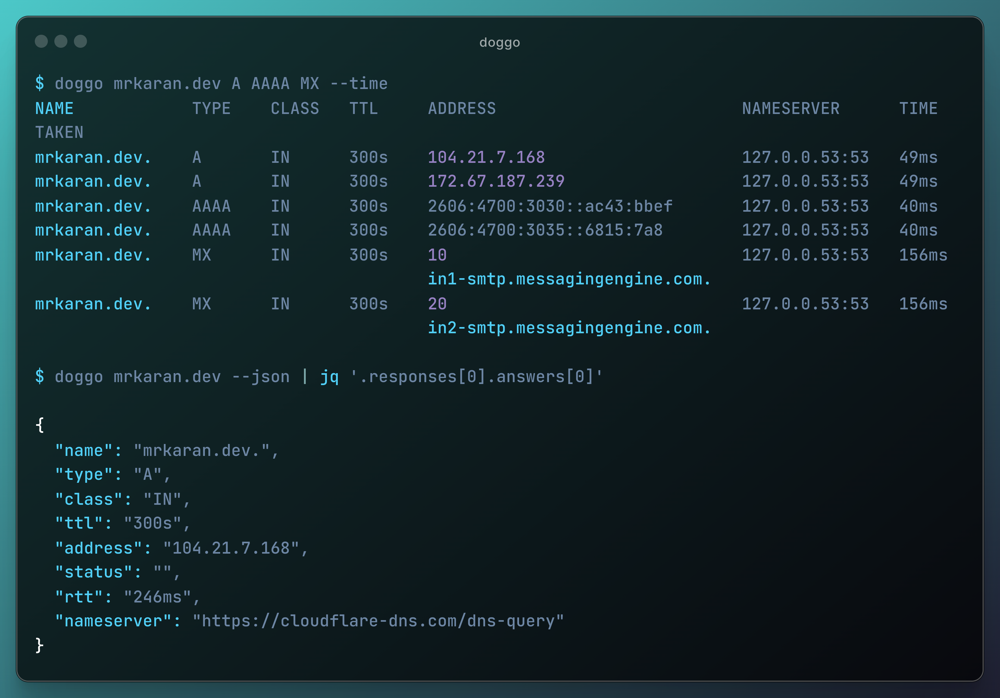

<!-- PROJECT LOGO -->
 

  <h2 align="center">doggo</h2>
  

    🐶 <i>Command-line DNS client for humans</i>
     
    <a href="https://doggo.mrkaran.dev">doggo.mrkaran.dev</a>
  

  

---

**doggo** is a modern command-line DNS client (like _dig_) written in Golang. It outputs information in a neat concise manner and supports protocols like DoH, DoT, DoQ, and DNSCrypt as well.

It's totally inspired from [dog](https://github.com/ogham/dog/) which is written in Rust. I wanted to add some features to it but since I don't know Rust, I found it as a nice opportunity
to experiment with writing a DNS Client from scratch in `Go` myself. Hence the name `dog` +`go` => **doggo**.

## Docs

Read the [documentation](https://doggo.mrkaran.dev/docs/) for more details.

## Contributing

I'm open to accept feature requests and/or issues. I understand `doggo` is a new DNS Client in the town and there might be some edge cases I am not handling.
Please feel free to open issues if you ever come across such a case.
For now I am focussing more on [planned features](TODO.md) for a **stable** v1.0 release _soon_.

## License

[LICENSE](./LICENSE)
