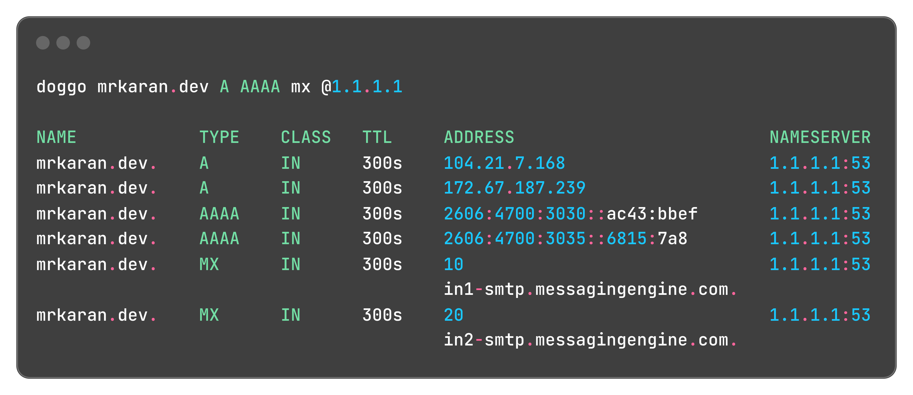

## Features

- Human-readable output with color-coded and tabular format
- JSON output support for easy scripting and parsing
- Multiple transport protocols:
  - DNS over HTTPS (DoH)
  - DNS over TLS (DoT)
  - DNS over QUIC (DoQ)
  - DNS over TCP
  - DNS over UDP
  - DNSCrypt
- Support for `ndots` and `search` configurations from `resolv.conf` or command-line arguments
- Multiple resolver support with customizable query strategies
- IPv4 and IPv6 support
- Web interface available at [doggo.mrkaran.dev](https://doggo.mrkaran.dev)
- Shell completions for `zsh` and `fish`
- Reverse DNS lookups
- Flexible query options including various DNS flags (AA, AD, CD, DO, etc.)
- Debug mode for troubleshooting
- Response time measurement
- Cross-platform support (Linux, macOS, Windows, FreeBSD, NetBSD)